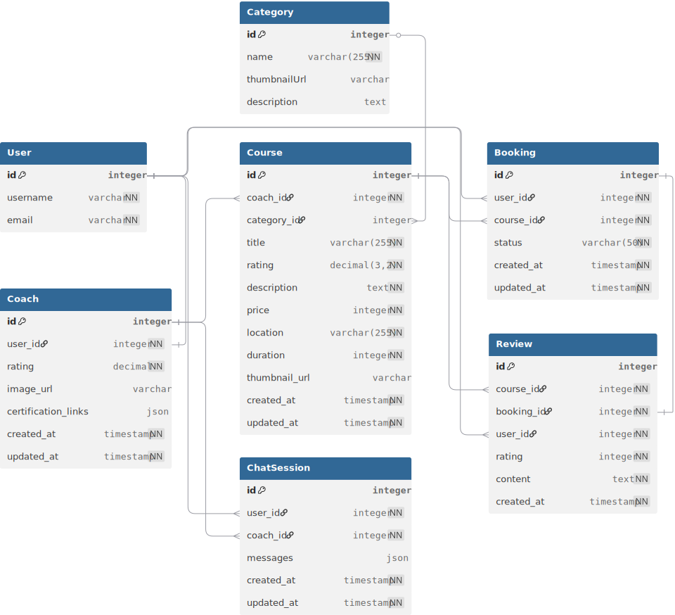

# MamiCoach
> [!Note]
> **Anggota Kelompok PBP E02**:
> - Galih Nur Rizqy (2406343224)
> - Kevin Cornellius Widjaja (2406428781)
> - Natan Harum Panogu Silalahi (2406496170)
> - Vincent Valentino Oei (2406353225)
> - Vincentius Filbert Amadeo (2406351711)


### Table of Contents
* [Anggota Kelompok](#MamiCoach)
* [Deskripsi Aplikasi](#Deskripsi-Aplikasi)
* [Penggunaan](#Penggunaan)
* [Daftar Modul](#Daftar-Modul)
* [ERD](#ERD)
* [Sumber Data](#Sumber-Data)
* [Peran Pengguna](#Peran-Pengguna)
* [Link Deployment dan Design](#Link-Deployment--Design)


## Deskripsi Aplikasi
$${\color{green}\textbf{Mami}}\textbf{Coach}$$ adalah platform yang menghubungkan pelatih profesional dengan pengguna yang ingin belajar langsung dari ahlinya. Kami memfasilitasi jual beli kelas online dengan sistem rating, review, dan verifikasi pelatih untuk memastikan kredibilitas. 

Pengguna dapat menemukan pelatih berkualitas, membeli kelas, dan berinteraksi langsung, sementara pelatih dapat membangun reputasi, mengelola murid, dan mengembangkan bisnisnya. MamiCoach menciptakan ekosistem belajar yang transparan, terpercaya, dan berorientasi pada hasil nyata.


---

## Penggunaan
Pastikan terlebih dahulu bahwa anda telah melakukan instalasi python pada device anda. Pastikan juga anda telah menduplikat file `.env.example` ke `.env`, serta mengisi file tersebut dengan environment variables yang sesuai dengan keperluan anda.

Kemudian jika OS anda adalah windows, jalankan:
```ps
.\setup.bat
```

Jika OS anda UNIX based, seperti linux, jalankan:
```
./setup.sh
```


## Daftar Modul

| Nama Modul | Deskripsi Singkat Modul | Penanggungjawab |
|-|-|-|
| Register dan Login | Membuat page register dan login untuk coach dan user biasa dengan mengextend user yang telah tersedia | - |
| Coach | Mencakup sistem sign up coach serta upload data yang diperlukan | - |
| Courses Batch | Mencakup index page dari kelas (menampilkan semua kelas, rekomendasi dan juga filter) | - |
| Courses Details | Details page dari kelas, serta edit dan delete page untuk kelas yang ada. | - |
| Booking | Mencakup fitur booking kelas, terinisiasi dari user biasa | - |
| Review | Mencakup pembuatan review | - |
| Chat | Mencakup fitur chat yang persistent antar pengguna dan coach terkait kelas tertentu | - |
| Homepage | Tampilan awal ketika user membuka website, mencakup hero, featured classes, featured coaches, dan testimonies | - |
| Layouting | Layout dari aplikasi secara keseluruhan, mencakup navbar dan footer | - |
| List Coaches| Page untuk menampilkan coach yang terdaftar | - |


## ERD

[ERD Link](https://dbdiagram.io/d/68e6390fd2b621e422d55017)


## Sumber Data
[Superprof.id](https://www.superprof.co.id/)
All data source are curated, obtained, and modified manually to fit data needs for this project. 


## Peran Pengguna

### 1. Pengguna (User)
Peran ini ditujukan untuk individu yang ingin belajar dan mengembangkan keterampilan baru. Mereka adalah konsumen utama di platform Mamicoach.

**Deskripsi & Hak Akses:**
- **Mencari & Menemukan:** Dapat menjelajahi semua kategori, mencari pelatih, dan memfilter kelas berdasarkan subjek, rating, atau harga.
- **Membeli Kelas:** Dapat melakukan transaksi pembelian kelas yang diminati.
- **Mengikuti Kelas:** Memiliki akses ke materi kelas yang sudah dibeli dan dapat berinteraksi dengan pelatih.
- **Memberi Rating & Review:** Setelah menyelesaikan kelas, mereka dapat memberikan penilaian dan ulasan yang akan terlihat oleh publik untuk membantu pengguna lain.

---

### 2. Pelatih (Coach)
Peran ini untuk para profesional atau ahli di bidangnya yang ingin membagikan ilmunya dan membangun bisnis pelatihan secara online.

**Deskripsi & Hak Akses:**
- **Profil Terverifikasi:** Memiliki halaman profil publik yang menampilkan keahlian, pengalaman, dan portofolio setelah melewati proses verifikasi oleh Mamicoach.
- **Membuat & Mengelola Kelas:** Dapat membuat, mengedit, dan mempublikasikan kelas online, termasuk menentukan kurikulum, harga, dan jadwal.
- **Mengelola Murid:** Dapat melihat daftar murid yang terdaftar di kelasnya, berinteraksi, dan memantau kemajuan mereka.
- **Membangun Reputasi:** Menerima rating dan review dari murid, yang akan membangun kredibilitas dan reputasi mereka di platform.


## Link Deployment & Design
- [Link Deployment](https://kevin-cornellius-mamicoach.pbp.cs.ui.ac.id/)
- [Link Figma](https://www.figma.com/design/Ysa8K8heNxQcG8eyjdRAXD/TK-PBP-E02?node-id=0-1&t=q5cEKERHtkHz8QlB-1)
